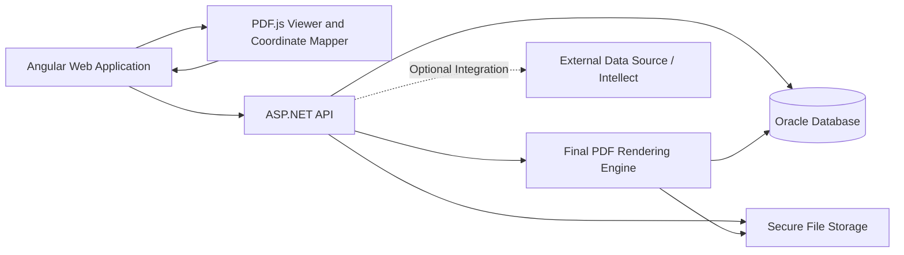

# PDF Coordinate Mapping Application  
## Project Overview and Architecture Context

**Document Type:** Functional and Technical Context  
**Version:** 1.0  
**Date:** 31 July 2026  
**Project:** PDF Coordinate Mapping Application  

---

# Current Implementation Override

For `PDFCordinateMapperModule`, the Admin module remains the structural reference for Maker-Checker behavior, APP/LOG handling, audit fields, status handling, and API conventions.

However, PDF module master approvals must use separate `MF_` Common Approval objects:

```text
MF_COMMON_APPROVAL_MASTER
MF_COMMON_APPROVAL_MASTER_LOG
MF_COMMON_APPROVAL_IUDS
MF_GET_COMMON_APPROVAL_DATA
```

Do not use or extend Admin approval objects for PDF module approvals:

```text
DDP_COMMON_APPROVAL_MASTER
DDP_COMMON_APPROVAL_MASTER_LOG
USP_COMMON_APPROVAL_IUDS
USP_GET_COMMAPPROVALDATA_CCIL
```

All new PDF module stored procedures must use standalone `MF_` names. Do not create packages for this module.

# 1. Project Overview

## 1.1 Introduction

The PDF Coordinate Mapping Application is a configurable web-based solution for registering AMC PDF templates, mapping Excel data fields to fixed PDF coordinates, validating uploaded investment data, and generating completed PDF forms.

The application is intended to standardize and automate PDF form preparation for different AMCs without hard-coding the PDF layout or field coordinates in the application code.

The solution supports:

- AMC-specific PDF templates
- Mapping of Excel headers to PDF coordinates
- Multiple field-rendering types
- Multi-line text
- Repeatable scheme rows
- Page-level mapping and printing configuration
- Excel upload and row-level validation
- Row-level Checker approval or rejection
- Generation of final grouped PDFs using approved rows only
- Download and print control
- Complete batch-level and row-level audit history

---

## 1.2 Business Objective

The primary objective is to reduce manual PDF form filling and provide a reusable configuration-driven platform where:

1. An AMC is maintained through Maker–Checker approval.
2. A PDF template is registered against the AMC.
3. Pages required for mapping and pages required for printing are configured.
4. Excel headers are mapped to PDF coordinates.
5. Mapping-field behaviour is configured according to the field type.
6. Users upload the approved Excel input format.
7. Uploaded rows are validated and can be corrected before submission.
8. Checker approval or rejection is performed at row level.
9. Final grouped PDFs are generated from approved rows only.
10. All significant actions are captured in audit logs.

---

## 1.3 Scope

The application scope includes the following functional areas.

### 1.3.1 AMC Master

AMC Master maintains the AMC information required for template registration and Excel-data processing.

The application's Admin module is already completed and tested. Therefore, AMC Master must follow the same existing Admin-module Maker–Checker and Common Approval implementation without introducing a separate approval architecture.

The implementation must reuse the established Admin-module conventions for:

- Live, APP, and LOG table handling
- Insert, update, delete, approve, and reject status values
- Maker and Checker validation
- Common Approval queue creation and processing
- Stored-procedure structure and action parameters
- API request and response handling
- Approval remarks and audit fields
- Duplicate validation
- Active/inactive behaviour

AMC Master uses:

- `MF_AMC_MASTER`
- `MF_AMC_MASTER_APP`
- `MF_AMC_MASTER_LOG`
- Existing `PMS_COMMON_APPROVAL_MASTER`

Only approved and active AMC records can be used during template registration, Excel validation, mapping resolution, or PDF generation.

---

### 1.3.2 PDF Template Registry

The Template Registry maintains the approved AMC PDF forms that can be used for coordinate mapping and PDF generation.

The existing tested Admin-module Maker–Checker and Common Approval pattern must be reused for Template Registry. Template Registry must not introduce a separate approval implementation.

#### Preconditions

Before a template can be registered:

- The AMC must exist in `MF_AMC_MASTER`.
- The AMC record must be approved and active.
- The user must have Template Registry Maker permission.
- The uploaded file must be a valid PDF.
- The uploaded file must satisfy the configured size and security validations.

#### Template Registry Maker process

1. The Maker opens Template Registry.
2. The Maker selects an approved and active AMC.
3. The Maker enters the template code and template name.
4. The Maker uploads the AMC PDF.
5. The API validates the uploaded file and stores it in secure template storage.
6. The Angular application loads the stored PDF through an authorized API endpoint.
7. PDF.js renders the PDF pages in the browser for preview and page selection.
8. The application displays the total PDF page count.
9. The Maker selects the pages that can be used in Template Mapping.
10. The Maker selects the pages that must be included in the final generated document.
11. The Maker configures the maximum number of repeatable data rows supported on one repeatable page.
12. The Maker confirms active/inactive status and other approved template metadata.
13. The record is saved using the existing Admin-module APP-table and Common Approval pattern.
14. The pending template is submitted to the existing Common Approval queue.

The selected pages are stored in `MF_TEMPLATE_MASTER` as:

```text
MAPPING_PAGE_NUMBERS
PRINT_PAGE_NUMBERS
```

The repeat capacity is stored in:

```text
REPEAT_ROWS_PER_PAGE
```

#### Template Registry Checker process

1. The Checker opens the existing Common Approval screen.
2. The Checker selects the pending Template Registry request.
3. The Checker reviews:
   - AMC
   - Template code and name
   - Uploaded PDF
   - Page count
   - Mapping pages
   - Printing pages
   - Repeat rows per page
   - Active/inactive status
   - Maker remarks
4. The Checker previews the uploaded PDF using PDF.js.
5. The Checker approves or rejects the request using the existing Common Approval mechanism.
6. On approval:
   - The approved data is inserted or updated in `MF_TEMPLATE_MASTER`.
   - The request history is inserted in `MF_TEMPLATE_MASTER_LOG`.
   - The APP and Common Approval statuses are updated using the existing Admin-module rules.
7. On rejection:
   - The rejection remark is mandatory.
   - The live approved template remains unchanged.
   - The rejected request remains available through existing audit/history behaviour.

#### Template update behaviour

When an approved template is edited:

- The current approved live template must remain available for production processing.
- The proposed changes must be stored in `MF_TEMPLATE_MASTER_APP`.
- The changed template becomes effective only after Checker approval.
- Production mapping and PDF generation must never use pending APP data.

#### Template Registry responsibilities

Template Registry is responsible for:

- AMC-template association
- PDF file metadata
- Secure template file reference
- Original and stored filenames
- File hash and file size
- PDF signature detection information, where applicable
- Total page count
- Mapping-page selection
- Printing-page selection
- Repeat rows per page
- Active/inactive status
- Maker–Checker audit fields

PDF.js is used for browser-side viewing and page interaction. It is not the authoritative storage mechanism and does not replace server-side PDF validation or final PDF generation.

### 1.3.3 Template Mapping

Template Mapping defines where and how approved Excel data is rendered on an approved AMC PDF template.

The existing tested Admin-module Maker–Checker and Common Approval pattern must also be reused for Template Mapping.

The mapping is maintained as one logical aggregate:

```text
MF_TEMPLATE_MAPPING_MAIN
    └── MF_TEMPLATE_MAPPING_FIELD
            └── MF_TEMPLATE_MAPPING_FIELD_CONFIG
```

The corresponding `_APP` and `_LOG` tables support pending changes and history.

#### Preconditions

Before mapping can begin:

- The AMC must be approved and active.
- The Template Registry record must be approved and active.
- The template PDF must be available through secure storage.
- Mapping-page numbers must already be configured in Template Registry.
- The user must have Template Mapping Maker permission.
- Excel headers must be available from the finalized input structure and must be stored directly against mapping fields.

#### Mapping Studio loading process

1. The Maker opens Template Mapping.
2. The Maker selects an approved AMC.
3. The Maker selects an approved and active template.
4. The API returns:
   - Template metadata
   - Authorized PDF access reference
   - Mapping-page numbers
   - Printing-page numbers
   - Repeat rows per page
   - Existing approved mapping, if any
   - Pending mapping request, if permitted by the existing Admin pattern
5. The Angular application loads the PDF through PDF.js.
6. PDF.js renders only the configured mapping pages for coordinate work.
7. The Mapping Studio displays:
   - PDF page canvas
   - Zoom controls
   - Page navigation
   - Excel-header list
   - Field-type selector
   - Field-property panel
   - Mapping overlay
   - Repeat-group settings
   - Preview controls

#### Use of PDF.js

PDF.js is the standard browser-side library for:

- Loading the PDF returned by the API
- Rendering each selected page
- Reading page dimensions
- Creating page viewports
- Zooming
- Page navigation
- Displaying existing mappings as overlays
- Capturing user-selected rectangles
- Converting screen coordinates into stable PDF-page coordinates
- Re-displaying saved coordinates independent of browser zoom

Coordinates must not be stored as raw browser pixels.

The application must convert the selected rectangle from the current PDF.js viewport into a canonical PDF coordinate representation before sending it to the API. The same canonical coordinates must be used by the final PDF-generation component.

The coordinate contract must define:

- Page number
- X position
- Y position
- Width
- Height
- Page rotation
- Coordinate origin
- Unit of measurement
- Zoom-independent transformation

PDF.js uses browser/canvas rendering coordinates for interaction. The application must consistently transform them to the agreed PDF-space coordinate system before persistence.

#### Creating a mapping field

For each Excel header, the Maker:

1. Selects the Excel header.
2. Selects the target PDF page.
3. Draws or selects the target area on the PDF.js-rendered page.
4. Selects the mapping field type.
5. Configures the required rendering behaviour.
6. Sets mandatory and active flags.
7. Assigns display sequence.
8. Configures repeat-group information where applicable.
9. Reviews the mapping overlay.
10. Saves the field into the pending mapping aggregate.

The field record stores information such as:

```text
FIELD_UID
FIELD_CODE
EXCEL_HEADER_NAME
FIELD_TYPE
PAGE_NO
X_POSITION
Y_POSITION
FIELD_WIDTH
FIELD_HEIGHT
DISPLAY_SEQUENCE
IS_REQUIRED
IS_REPEATABLE
REPEAT_GROUP_CODE
ISACTIVE
```

Exact column names must follow the finalized database script and existing naming conventions.

#### Field-specific configuration

Type-specific configuration is stored in:

```text
MF_TEMPLATE_MAPPING_FIELD_CONFIG
```

Examples include:

- Font size and alignment for `TEXT_FIELD`
- Box dimensions and spacing for `CHAR_GRID`
- Date format and separator handling for `DATE_GRID`
- Option values and marks for `OPTION_GROUP`
- Controlled expression details for `COMPUTED_FIELD`
- Repeat-row offset or slot configuration

Rows per page must not be stored in field configuration. It remains a Template Registry setting in `MF_TEMPLATE_MASTER`.

#### Repeatable mapping

Related scheme-level fields are connected through a repeat-group code.

Example:

```text
REPEAT_GROUP_CODE = SCHEME_DETAILS
```

The Maker maps the first repeatable slot and configures either:

- A validated row-offset rule, or
- Explicit coordinates for each supported slot

The maximum slot count comes from:

```text
MF_TEMPLATE_MASTER.REPEAT_ROWS_PER_PAGE
```

The Mapping Studio must preview every configured slot before submission.

#### Mapping validation before submission

Before a mapping request can be submitted, the API must validate:

- Approved active template exists
- Every mapped page is included in Template Registry mapping pages
- Coordinates remain inside the PDF page boundary
- Width and height are greater than zero
- Excel header is valid
- Field code is unique within the mapping
- Required type configuration exists
- Option groups contain valid options
- Computed expressions use allowed syntax
- Repeatable fields have valid group and slot configuration
- Required mappings are complete
- Duplicate conflicting coordinates are handled according to the approved rule
- Mapping aggregate contains no orphan field configuration

Validation must be performed by the API even if Angular has already performed client-side validation.

#### Mapping submission and approval

1. The Maker saves Mapping Main, Mapping Fields, and Field Configurations as one pending aggregate.
2. The API writes the aggregate using the existing Admin-module APP and Common Approval pattern.
3. The Maker submits the mapping request for Checker approval.
4. The Checker opens the request through the existing Common Approval screen.
5. The Checker views the pending mapping overlay on the PDF using PDF.js.
6. The Checker reviews all fields and configurations as one logical mapping.
7. The Checker approves or rejects the complete mapping request.
8. On approval:
   - Mapping Main is inserted or updated in the live table.
   - Mapping Fields are inserted or updated in the live table.
   - Field Configurations are inserted or updated in the live table.
   - LOG records are created.
   - Common Approval is updated.
   - The complete aggregate becomes available for production processing.
9. On rejection:
   - Rejection remark is mandatory.
   - The existing approved live mapping remains unchanged.
   - The pending mapping is not used for Excel validation or PDF generation.

The header, fields, and field configurations must be approved atomically. Partial approval of individual mapping fields is not permitted.

#### Mapping update behaviour

When an approved mapping is edited:

- Existing approved live mapping remains in use.
- Changes are written to the relevant APP tables.
- The pending aggregate is reviewed through Common Approval.
- Only after approval are the live mapping tables replaced or updated.
- Historical values remain available in LOG tables.
- No separate mapping-version column is required.

#### Runtime use

Operational processing must resolve only:

- Approved and active AMC
- Approved and active Template Registry record
- Approved and active Mapping Main
- Approved Mapping Fields
- Approved Field Configurations

APP-table data must never be used for production Excel validation, draft generation, or final PDF generation.

### 1.3.4 Supported Mapping Field Types

The application supports the following field types:

#### `TEXT_FIELD`

Used for normal text rendering.

It supports:

- Single-line text
- Multi-line text
- Text wrapping
- Text alignment
- Font configuration
- Character shrinking
- Overflow handling

A multi-line text field can print one source value across multiple configured rows.

#### `CHAR_GRID`

Used where every character is printed in an individual box.

Typical use cases include:

- PAN
- Applicant name
- Client ID
- DP ID

Configuration includes box width, box height, spacing, and maximum box count.

#### `DATE_GRID`

Used where a date must be split across separate boxes.

Configuration includes:

- Date format
- Box size
- Box spacing
- Maximum characters
- Date-separator handling
- Invalid-date behaviour

#### `OPTION_GROUP`

Used for checkbox or radio-button selections.

Configuration includes:

- Selection mode
- Source value
- Option label
- Option-specific coordinates
- Marking value

#### `COMPUTED_FIELD`

Used where the PDF value is derived from one or more input values instead of being taken directly from one Excel column.

Computed expressions must use a controlled application expression format and must not execute unrestricted SQL.

---

### 1.3.5 Repeatable Row Processing

Repeatable row processing is required for scheme-level details such as:

- Investment Details
- Plan
- Option and Sub Option
- Investment Amount
- Other scheme-related fields

Repeatable fields are logically connected through a repeat-group code.

Example:

```text
REPEAT_GROUP_CODE = SCHEME_DETAILS
```

The maximum number of source rows printed on one form page is maintained in `MF_TEMPLATE_MASTER`.

Example:

```text
REPEAT_ROWS_PER_PAGE = 4
```

For ten source records:

- Records 1–4 are printed on the first generated page instance.
- Records 5–8 are printed on the second generated page instance.
- Records 9–10 are printed on the third generated page instance.
- Unused positions on the final page remain blank.

The field configuration table stores the coordinate offsets or explicit slot positions used for each repeated row.

---

### 1.3.6 Excel Upload and Data Processing

The approved Excel format contains 54 business columns.

For clarity and ease of maintenance, all 54 input columns are stored directly in:

```text
MF_PDF_PROCESS_ROW
```

A dynamic row-value table is not used.

Each uploaded Excel file creates one batch record in:

```text
MF_PDF_PROCESS_BATCH
```

Each Excel data row creates one record in:

```text
MF_PDF_PROCESS_ROW
```

The application preserves:

- Original uploaded row data
- Current editable values
- Validation result
- Row status
- Edit information
- Checker decision
- Checker remarks
- Template and mapping references used for processing

Users can edit row data before submission for approval.

---

### 1.3.7 Validation

The application validates:

- File format
- Header names
- Header sequence
- AMC existence and active status
- Approved template availability
- Approved mapping availability
- Mandatory field values
- Field-format rules
- Mapping configuration
- Applicant-related conditions
- Nominee-related conditions
- Client-group consistency
- Repeatable-row capacity
- PDF-generation prerequisites

Validation errors are stored in:

```text
MF_PDF_PROCESS_VALIDATION_ERROR
```

Errors are retained by validation run and are marked resolved after successful correction and revalidation.

Scheme Master and ISIN Master validation are not required in the current scope.

---

### 1.3.8 Row-Level Checker Decision

The Excel-to-PDF processing workflow does not use APP tables or Common Approval.

It is controlled through status IDs in the batch and row tables.

Checker action is performed at row level:

- Approve
- Reject

A rejected row must contain a Checker remark.

The batch status is derived from the row statuses.

#### Batch status rules

```text
If any row is pending for approval:
    Batch status = PENDING_FOR_APPROVAL

If no row is pending and all rows are approved:
    Batch status = APPROVED

If no row is pending and both approved and rejected rows exist:
    Batch status = PARTIALLY_APPROVED

If no row is pending and all rows are rejected:
    Batch status = REJECTED
```

Final grouped PDFs are generated using approved rows only.

For a partially approved batch:

- Approved rows are included in final grouped PDFs.
- Rejected rows are excluded.
- Download and print are enabled only for final output generated from approved rows.

---

### 1.3.9 PDF Generation

The PDF-generation engine performs the following responsibilities:

- Resolve the approved AMC template
- Resolve approved mapping fields and configuration
- Load mapping pages and printing pages
- Group records logically using approved master configuration and input values
- Apply field-type-specific rendering
- Apply repeatable-row capacity
- Duplicate mapped pages when the configured capacity is exceeded
- Preserve configured static printing pages
- Generate draft PDFs
- Generate final grouped PDFs using approved rows
- Store file hash and document metadata
- Enable download and print according to status

Generated-document metadata is stored in:

```text
MF_PDF_GENERATED_DOCUMENT
```

---

### 1.3.10 Audit

Only two audit-log tables are required for the Excel-to-PDF processing workflow:

- `MF_PDF_PROCESS_BATCH_LOG`
- `MF_PDF_PROCESS_ROW_LOG`

#### Batch log

Captures:

- File upload
- Header validation
- Data loading
- Batch status changes
- Draft generation
- Submission for approval
- Final PDF generation
- Download
- Print
- Completion
- Failure

#### Row log

Captures:

- Row loading
- Row editing
- Validation
- Submission
- Checker approval
- Checker rejection
- Status changes
- Old and new row snapshots
- Changed fields
- Checker remarks

Audit records are append-only and must not be updated or deleted through normal application functions.

---

# 2. Architecture Context

## 2.1 Architecture Style

The application follows a layered, configuration-driven architecture.

The main layers are:

1. Angular web application
2. ASP.NET API layer
3. Oracle database
4. PDF processing and rendering component
5. File/document storage
6. Optional external integrations

The solution separates:

- Configuration data
- Operational processing data
- Generated documents
- Audit history

---

## 2.2 Logical Architecture



---

## 2.3 Front-End Responsibilities

The Angular application is responsible for:

- User authentication and authorization integration
- AMC Master screens
- Template Registry screens
- PDF upload and page selection
- Mapping Studio
- Coordinate capture
- Field-type configuration
- Excel upload
- Validation-result display
- Row editing
- Draft-PDF preview
- Row-level Checker decision
- Final-document download and print
- Audit-history display

The UI sends structured arrays and models to the API. It must not directly construct database-specific comma-separated values or execute business rules that belong to the API.

---

## 2.4 PDF.js Architecture

PDF.js is reused in the Angular application because it has already been used in the project environment.

Its role is limited to browser-side PDF interaction.

### PDF.js responsibilities

- Render the uploaded template PDF
- Display individual pages
- Read page width, height, rotation, and viewport information
- Support zoom and page navigation
- Display mapping rectangles and field labels
- Capture pointer-based field coordinates
- Convert between rendered viewport coordinates and canonical stored coordinates
- Preview Template Registry page selections
- Preview pending and approved Template Mapping requests for Maker and Checker

### Responsibilities outside PDF.js

PDF.js must not be treated as:

- The database mapping store
- The template file repository
- The master approval engine
- The final production PDF-writing engine
- The digital-signature engine
- The authoritative server-side PDF validator

The API remains responsible for authorization, validation, persistence, approval status, and generation orchestration.

The final PDF-rendering component must consume the same canonical coordinates persisted by Template Mapping.

### PDF.js file-access rule

The Angular application must not receive or expose unrestricted physical file-system paths.

The PDF must be loaded through an authorized API endpoint using one of the approved mechanisms:

- Blob response
- Authorized short-lived document URL
- Application-controlled file stream

The API must verify template eligibility and user permission before returning PDF content.

### Coordinate persistence rule

Coordinate values must remain stable across:

- Browser resolution
- Zoom level
- Canvas size
- Device pixel ratio
- Reopening the mapping
- Checker preview
- Final PDF rendering

Therefore, raw DOM or canvas pixel positions must never be stored directly.

---

## 2.5 API Responsibilities


The ASP.NET API is responsible for:

- Authentication and authorization enforcement
- Input validation
- Template and mapping resolution
- Excel parsing
- Header validation
- Row-data normalization
- Business validation
- Row editing
- Status transitions
- Batch-status recalculation
- Logical record grouping
- PDF rendering orchestration
- File management
- Audit-log creation
- Transaction management
- External integration orchestration

All business updates and corresponding audit inserts must execute within the same database transaction.

---

## 2.6 Database Architecture

The Oracle database is divided into the following logical domains.

### 2.6.1 AMC Master Domain

```text
MF_AMC_MASTER
MF_AMC_MASTER_APP
MF_AMC_MASTER_LOG
PMS_COMMON_APPROVAL_MASTER
```

Purpose:

- Maintain AMC information
- Support Maker–Checker
- Preserve approved and historical AMC data

---

### 2.6.2 Template Configuration Domain

```text
MF_TEMPLATE_MASTER
MF_TEMPLATE_MASTER_APP
MF_TEMPLATE_MASTER_LOG
```

Purpose:

- Register PDF templates
- Store uploaded PDF metadata
- Store mapping pages
- Store printing pages
- Store repeatable rows-per-page
- Support Maker–Checker

---

### 2.6.3 Mapping Configuration Domain

```text
MF_TEMPLATE_MAPPING_MAIN
MF_TEMPLATE_MAPPING_MAIN_APP
MF_TEMPLATE_MAPPING_MAIN_LOG

MF_TEMPLATE_MAPPING_FIELD
MF_TEMPLATE_MAPPING_FIELD_APP
MF_TEMPLATE_MAPPING_FIELD_LOG

MF_TEMPLATE_MAPPING_FIELD_CONFIG
MF_TEMPLATE_MAPPING_FIELD_CONFIG_APP
MF_TEMPLATE_MAPPING_FIELD_CONFIG_LOG
```

Purpose:

- Maintain mapping header
- Maintain PDF field coordinates
- Maintain field types
- Maintain field rendering rules
- Maintain repeat-group information
- Maintain field configuration
- Support Maker–Checker and history

---

### 2.6.4 Operational Processing Domain

```text
MF_PDF_PROCESS_STATUS_MASTER
MF_PDF_PROCESS_BATCH
MF_PDF_PROCESS_ROW
MF_PDF_PROCESS_VALIDATION_ERROR
MF_PDF_GENERATED_DOCUMENT
```

Purpose:

- Upload tracking
- Row data storage
- Validation
- Row-level Checker decision
- Batch-status derivation
- Generated-document tracking

No `_APP` tables are used in the operational processing domain.

---

### 2.6.5 Audit Domain

```text
MF_PDF_PROCESS_BATCH_LOG
MF_PDF_PROCESS_ROW_LOG
```

Purpose:

- Append-only operational audit
- Data-change history
- Checker-decision history
- Status-transition history
- File-generation, download, and print history

---

## 2.7 File Storage Architecture

Uploaded and generated files should be stored in secure file or object storage.

The database should store only:

- Original filename
- Stored filename
- File path or document reference
- File hash
- File size
- Signature status
- Creation metadata

Large PDF and Excel binary content should not be stored directly in normal transactional tables unless a separate infrastructure decision explicitly requires database BLOB storage.

Suggested storage categories:

```text
/templates
/uploads
/drafts
/final
/validation-errors
```

---

## 2.8 Status Architecture

Status values are centrally maintained in:

```text
MF_PDF_PROCESS_STATUS_MASTER
```

The status master supports separate entity types:

- `BATCH`
- `ROW`
- `VALIDATION_ERROR`
- `DOCUMENT`

This keeps status logic explicit and avoids hard-coded status descriptions in application code.

The API must validate that the selected status belongs to the correct entity type.

---

## 2.9 Data-Grouping Architecture

No physical process-group or process-group-row tables are required.

Grouping is calculated logically using:

- AMC
- Approved template configuration
- Client-identification fields
- Repeat-group configuration
- Input row values

The exact group key used for a generated PDF should be persisted with the generated document for audit and reproducibility.

---

## 2.10 Transaction Boundaries

The following operations must be transactional:

### AMC Master approval

AMC Master approval must execute through the same tested Admin-module Maker–Checker/Common Approval pattern.

- Update APP status
- Insert or update live master
- Insert log
- Update Common Approval
- Commit or rollback as one unit

### Template Registry save and approval

- Validate AMC, PDF, page selections, and repeat capacity
- Store the PDF through secure storage
- Insert or update Template APP data
- Insert or update Common Approval
- Commit database changes only when the required file-storage operation succeeds
- On Checker approval, update live Template Master and LOG using the existing Admin-module transaction pattern

### Template Mapping save and approval

Template Mapping approval must reuse the same Admin-module approval conventions, while approving Mapping Main, Mapping Fields, and Field Configurations as one aggregate.

- Approve mapping header
- Approve all mapping fields
- Approve all field configurations
- Update live tables
- Insert logs
- Update Common Approval using the existing pattern
- Commit or rollback as one unit

### Row editing

- Update process row
- Insert row audit log
- Revalidate affected row
- Update validation errors
- Recalculate batch status where applicable
- Insert batch audit log where status changes
- Commit or rollback as one unit

### Checker decision

- Update row status
- Store Checker and remarks
- Insert row log
- Recalculate batch status
- Update batch
- Insert batch log
- Commit or rollback as one unit

### Final PDF generation

- Select approved rows
- Generate grouped PDF
- Store document metadata
- Update batch counters/status
- Insert batch audit event
- Commit database changes only after successful file creation

---

## 2.11 Security Context

Security should be enforced at API and database-operation level.

Key requirements include:

- Only authorized users can maintain masters and templates.
- Maker and Checker must be different users for configuration masters.
- Only Checker-authorized users can approve or reject process rows.
- Approved mapping tables must be used for PDF generation.
- Pending APP records must never be used for production processing.
- Rejected process rows must be excluded from final PDFs.
- Download and print must be enabled only for eligible generated documents.
- Audit records must not be editable through business APIs.
- File paths must not be exposed directly to unauthorized users.
- Download APIs should validate user permission and document eligibility.

---

## 2.12 Integration Context

The architecture permits future integration with Intellect or another data source.

Potential integration responsibilities include:

- Fetching applicant details
- Fetching account details
- Cross-checking uploaded values
- Populating configured source-system fields

The following items remain dependent on final external-system confirmation:

- Connectivity mechanism
- Authentication
- Retrieval query or API
- Timeout and retry behaviour
- Data precedence
- Error handling
- Reconciliation rules

The core template, mapping, Excel-validation, row-approval, and PDF-generation architecture does not depend on Scheme Master or ISIN Master in the current scope.

---

## 2.13 Digital Signature Context

Digital signing is optional.

When enabled, the signing component should operate only on final PDFs generated from approved rows.

The generated-document record should retain:

- Digital-signature status
- Signature details
- Signed file hash
- Signing timestamp
- Signed filename or storage reference

The signing provider, certificate model, placement, and verification mechanism remain implementation-specific.

---

## 2.14 Architectural Principles

The implementation should follow these principles:

1. **Reuse the tested Admin architecture**  
   The completed Admin module is the mandatory reference for authentication, authorization, master Maker–Checker, APP/LOG handling, status values, stored procedures, API conventions, and Common Approval. These mechanisms must not be redesigned for this project.

2. **Configuration over hard-coding**  
   AMC layouts, fields, coordinates, page selections, and repeat capacity must come from approved configuration.

3. **PDF.js for browser interaction**  
   PDF.js must be reused for template preview, page navigation, zoom, and coordinate mapping. It must not be used as a substitute for approved mapping persistence or the final production PDF-writing engine.

4. **Zoom-independent coordinates**  
   Mapping coordinates must be persisted in a canonical PDF-space representation and must not depend on rendered canvas pixels.

5. **Atomic mapping aggregate**  
   Mapping Main, Mapping Fields, and Field Configurations must be saved, submitted, approved, rejected, and logged as one logical aggregate.

6. **Approved configuration only**  
   Operational PDF generation must never consume pending APP data.

7. **Row-level decision control**  
   Checker approval or rejection is maintained against individual process rows.

8. **Derived batch status**  
   Batch status is calculated from row statuses and is not independently decided by the Checker.

9. **Approved-row output only**  
   Final documents include only approved rows.

10. **Auditability**  
   Every important data change, status change, approval decision, download, and print event must be traceable.

11. **Original-data preservation**  
   Uploaded values must remain available even after user corrections.

12. **Transactional consistency**  
   Business updates and audit writes must succeed or fail together.

13. **Extensible field rendering**  
   Field-type configuration must support future rendering options without redesigning the core mapping model.

14. **Secure file handling**  
    File references, hashes, permissions, and generated-document eligibility must be controlled by the API.

---

# 3. Current Architecture Baseline

> **Mandatory implementation baseline:** The existing tested Admin module remains unchanged and is reused for login, user/role/module/menu access, authorization, Maker–Checker, APP/LOG processing, and Common Approval. The tables listed below represent business additions to that existing foundation.


The finalized baseline consists of:

## Master and Configuration

```text
MF_AMC_MASTER / APP / LOG
MF_TEMPLATE_MASTER / APP / LOG
MF_TEMPLATE_MAPPING_MAIN / APP / LOG
MF_TEMPLATE_MAPPING_FIELD / APP / LOG
MF_TEMPLATE_MAPPING_FIELD_CONFIG / APP / LOG
PMS_COMMON_APPROVAL_MASTER
```

## Operational Processing

```text
MF_PDF_PROCESS_STATUS_MASTER
MF_PDF_PROCESS_BATCH
MF_PDF_PROCESS_ROW
MF_PDF_PROCESS_VALIDATION_ERROR
MF_PDF_GENERATED_DOCUMENT
```

## Operational Audit

```text
MF_PDF_PROCESS_BATCH_LOG
MF_PDF_PROCESS_ROW_LOG
```

## PDF Viewing and Coordinate Mapping

```text
PDF.js
```

PDF.js is reused in Angular for Template Registry preview and Template Mapping coordinate interaction.

## Mapping Types

```text
TEXT_FIELD
CHAR_GRID
DATE_GRID
OPTION_GROUP
COMPUTED_FIELD
```

## Final Output Rule

```text
Final grouped PDFs are generated only from approved rows.
```
