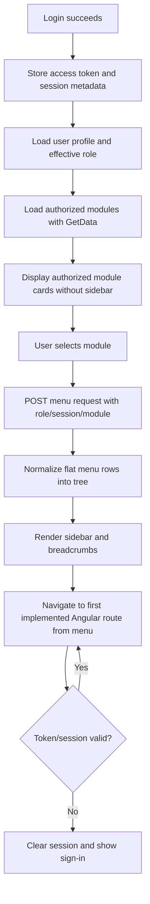

# CCIL User Management and Menu UI Architecture

## 1. Purpose and Scope

This document is the design handoff for rebuilding the CCIL user-management experience as an Angular standalone UI. It covers presentation, navigation, state, interaction behavior, permission-aware rendering, and the adapter boundary around the existing APIs.

The API and database remain the source of truth. The Angular application should not reproduce stored-procedure or database logic. It should translate API responses into stable view models, enforce client-side interaction rules for usability, and rely on the API for authorization and final validation.

The existing application already has these business surfaces:

- User Master: create, edit, activate/deactivate, lock/unlock and delete user records.
- Role Master: create and edit roles, set active state, and map menus to roles.
- Role Module Mapping/Menu Access: choose a role, inspect its menu tree, select accessible menus, submit or cancel the mapping.
- Dynamic application menu: load a module-specific hierarchical menu for the signed-in user and render parent, child and grandchild items.
- Approval-aware record views: All Records, Approved Records, Deleted Records, and pending approval information in the grid/action remark.

## 2. Existing Project Context

The current implementation is MVC plus AngularJS. The main source surfaces are:

- `BAL/User_Master.cs`: user fields such as User_Id, User_Name, Email, Group_Id, Active, branch and department values.
- `BAL/Role_Master.cs`: role code, name, description, active state and audit/user fields.
- `Webapi/Controllers/UserMasterController.cs`: save, list and delete user operations.
- `Webapi/Controllers/RoleMasterController.cs`: save, list, delete and role/module-related operations.
- `Webapi/Controllers/MenuController.cs`: loads the runtime menu by role and module.
- `Webapi/Controllers/MenuAccessController.cs`: loads roles, loads role menu access, loads module menu rows and saves menu access.
- `CCIL/Views/UserMaster/UserMaster.cshtml` and `CCIL/APP/Components/UserMaster.js`: current user form, validation, tabs and grids.
- `CCIL/Views/RoleMaster/RoleMaster.cshtml` and `CCIL/APP/Components/RoleMaster.js`: current role form, menu mapping modal, grids and approval behavior.
- `CCIL/Views/RoleModuleMapping/RoleModuleMapping.cshtml`: current role selector, menu grid, submit/cancel and authorization popup.
- `CCIL/Views/Shared/_Layout.cshtml` and `CCIL/APP/Components/menu.js`: current header, dynamic menu, user display and logout.

The new UI should preserve the business vocabulary above while replacing the tightly coupled AngularJS/jQuery layout with standalone Angular components.

## 3. Product Information Architecture

Use a persistent application shell after login:

```text
CCIL Shell
|-- Header
|   |-- Brand/logo
|   |-- Breadcrumb and current module/page
|   |-- Notifications/status area (optional, API-backed)
|   |-- Signed-in user menu
|       |-- My profile
|       |-- Change password
|       |-- Logout
|-- Sidebar / responsive navigation
|   |-- Dashboard or module landing page
|   |-- User Management
|   |   |-- Users
|   |   |-- Roles
|   |   |-- Role Menu Mapping
|   |   |-- User Approval (if exposed by API)
|   |-- Other authorized CCIL modules
|-- Main content outlet
|-- Global feedback layer
    |-- Toasts
    |-- Confirmation dialogs
    |-- Loading indicator
    |-- Session-expired dialog
```

The navigation is data-driven. Do not hard-code every menu item in the Angular template. Load authorized modules after authentication and show them as cards without the sidebar. Load the authorized menu tree only after the user selects a module, then render menus from a normalized `MenuNode[]` model.

### Recommended routes

```text
/login
/app
/app/home
/app/users
/app/users/new
/app/users/:id/edit
/app/roles
/app/roles/new
/app/roles/:id/edit
/app/role-menu-mapping
/app/approvals/users
/app/approvals/roles
/app/profile
/app/change-password
```

Route names can be changed to match the API or deployment convention, but the route responsibilities should remain separate. A user edit route should not be implemented as an opaque grid callback only; it must be deep-linkable and refresh-safe.

## 4. Visual and Interaction Direction

The current application uses a dark blue-gray HDFC header, a light content area, Bootstrap-style controls, tabbed record sections and dense data grids. Keep that familiar operational character, but make the new UI cleaner and more consistent.

### Layout

- Desktop: fixed 248px navigation rail, 64px header, flexible content area.
- Tablet: collapsible navigation rail; content remains a single column.
- Mobile: top header with menu button; navigation opens as a full-height drawer.
- Content max width: 1440px with 24px page padding.
- Forms: use a 12-column responsive grid. Avoid fixed widths that cause horizontal scrolling.
- Tables: sticky header, visible row actions, server-side pagination where supported, horizontal scroll only inside the table region.
- Cards: use only for real tools or summaries; do not nest cards inside cards.

### Visual tokens

Use CSS variables in the Angular design system:

```css
:root {
  --ccil-navy: #263f5a;
  --ccil-navy-dark: #1d3045;
  --ccil-blue: #1479b8;
  --ccil-blue-soft: #e8f3fb;
  --ccil-ink: #1e2933;
  --ccil-muted: #667482;
  --ccil-line: #d9e1e8;
  --ccil-surface: #ffffff;
  --ccil-page: #f4f7fa;
  --ccil-success: #137a54;
  --ccil-warning: #a56300;
  --ccil-danger: #b42318;
  --ccil-focus: #1479b8;
}
```

- Use one primary action per screen, normally `Save` or `Update`.
- Use `Cancel` as a secondary neutral action, not as a danger-colored action.
- Use red only for destructive actions or destructive status labels.
- Use text plus an icon for clear commands; use familiar icon-only buttons for compact row actions with tooltips.
- Always show visible labels, required markers and inline validation text.
- Use a confirmation dialog for delete, deactivate, lock/unlock, and unsaved navigation.
- Announce success and errors through an accessible live region/toast, not browser `alert()`.

## 5. User Management Screen

### Screen purpose

Manage the identity, organizational attributes, role and lifecycle status of a user. The screen has two coordinated areas:

1. User editor panel.
2. User records table with status/approval tabs.

### Page header

- Breadcrumb: `Administration / User Management`.
- Title: `Users`.
- Supporting text: `Create, update and manage access for application users.`
- Actions: `Add user`, `Export` if supported, and a compact refresh button.

### Form sections

#### Identity

- User ID / Employee Code: required, max 35 characters, alphanumeric and spaces only according to the existing validation. Disabled during edit.
- User / Employee Name: required, allowed characters should be confirmed with the API; current UI allows letters, numbers, spaces and apostrophe.
- Email ID: required; current validation accepts `hdfcbank.com`, `in.hdfcbank.com` and `hdfc.bank.in` domains. Make the domain rule configurable rather than embedding it in a component.

#### Organization

- Branch Code: required.
- Branch Name: required.
- Department Code: required.
- Department Name: required.

If the API has canonical branch/department lookup endpoints, use searchable comboboxes. If only free text is available, use text fields but preserve the API's exact values on edit.

#### Access and lifecycle

- Role: required searchable combobox. Display role name, store role/group identifier.
- Status: required select with the API-supported values:
  - Active
  - InActive
  - Locked
  - Unlock
  - Revoke
  - Dormant, only when the backend permits it
  - Delete, only as a controlled destructive lifecycle operation if the API exposes it
- Never offer `Dormant` for a new user if the existing rule remains in force.
- New users must be submitted as `Active` if that is still required by the backend.
- A signed-in user cannot modify their own user ID. The UI should disable that action and the API must enforce it as well.

### User form actions

`Add user`

- Clears the form, sets mode to create, sets default status to Active, and focuses User ID.
- The form title becomes `Create user`.

`Save user`

- Runs required-field, format, duplicate and lifecycle validation.
- Checks duplicate User ID and email before submit if the list is loaded; the API remains authoritative.
- Shows a review confirmation containing User ID, name, role and status.
- Sends the create payload through `UserManagementFacade`.
- On success, shows the API message, clears the form, refreshes the selected record tab and keeps the user on the page.
- On failure, keeps entered values, maps field-level errors where possible, and shows a correlation/reference message if supplied.

`Update user`

- Appears only in edit mode.
- Prevents changing User ID.
- Shows a changed-fields summary in the confirmation dialog.
- Submits the update and refreshes all affected table views.

`Cancel`

- If the form is dirty, asks `Discard changes?`.
- Clears the form and returns to create mode after confirmation.

`Edit` row action

- Loads the row into the form, changes the title to `Edit user`, scrolls/focuses the form, and changes `Save user` to `Update user`.
- If the record is already pending approval, show it as read-only or explain that another update cannot be submitted until approval, matching the API result.

`Deactivate`, `Lock`, `Unlock`, `Delete`

- Render only when allowed by the current permission set and row state.
- Open a reason/confirmation dialog when required by the API or audit policy.
- Never delete immediately on a single click.

`Export`

- Exports the currently selected tab and applied filters, not an unrelated full dataset.
- Show a progress state for large exports and use a generated filename such as `CCIL-users-approved-2026-07-23.xlsx`.

### User record tabs

Keep the existing tab semantics, but show counts when available:

- `All records`: all records returned for the current user scope.
- `Approved records`: approved/active master records.
- `Deleted records`: deleted or soft-deleted records.
- Optional `Pending approval`: expose separately if the API distinguishes it from All Records.

Tab switching must:

1. Update the route query parameter, for example `?view=approved`.
2. Preserve filters and page size.
3. Load the correct dataset or apply the correct adapter filter.
4. Show loading, empty and error states.

### User table columns

Display only the fields useful for operations by default:

- User ID
- User name
- Email
- Role
- Branch code/name
- Department code/name
- Status
- Action remark / approval state
- Created date/by
- Modified date/by
- Row actions

Allow a column chooser for audit columns. Keep Auto ID and internal role/group IDs hidden.

### User table behavior

- Search across User ID, name and email.
- Filters for role, status, branch, department and approval state.
- Sort by User ID, name, status, created date and modified date.
- Pagination with 10, 25, 50 and 100 options.
- Preserve selection only for the current page.
- Show `No users found` with a clear reset-filters action.
- Keyboard support: Enter submits a valid form, Escape closes dialogs, and row actions are reachable by Tab.

## 6. Role Management Screen

### Screen purpose

Define reusable roles and bind each role to the menu nodes the role is allowed to access.

### Form fields

- Role Code: internal/system value. The legacy UI currently derives it from Role Name in one flow; keep this as an API mapping concern and do not silently overwrite a user-entered code without an explicit product decision.
- Role Name: required and unique.
- Description: optional, multiline text.
- Active: switch/toggle.
- Menu access summary: read-only count such as `18 menus selected` with `Manage mapping` action.

### Role actions

`Save role`

- Requires role name and at least one selected menu if the API requires mapping on create.
- Validates duplicate role name/code.
- Saves role and menu mapping as one coordinated workflow when the API supports it; otherwise save the role first and then save mapping with a clear partial-success state.

`Update role`

- Loads the role into the form.
- Role Code is read-only if the backend treats it as immutable.
- Shows the selected menu count and lets the operator open mapping before submitting.

`Manage mapping`

- Opens a full-screen route or wide drawer on desktop, rather than a 950px modal. On mobile it becomes a full-screen page.
- Loads the complete menu tree and current role selections.
- Shows selected count, search, expand/collapse controls, and unsaved-change state.

`Cancel`

- Clears create/edit mode after dirty-state confirmation.

`Activate` / `Deactivate`

- Uses a confirmation dialog and explains effect on users assigned to the role.
- Never remove menu assignments just because a role becomes inactive.

### Role table columns

- Role Name
- Description
- Active status
- Menu count
- Created date/by
- Modified date/by
- Approved date/by
- Action remark
- Row actions: Edit, Manage mapping, Activate/Deactivate

Use separate views or tabs for pending and approved data if the API exposes both. Do not label a record as approved based only on a missing action remark.

## 7. Role Menu Mapping Screen

### Screen purpose

Assign hierarchical menus to a role. The current implementation selects grid rows and builds a comma-separated list containing selected menu IDs and parent IDs. The new UI should preserve that parent access behavior while representing it as a tree.

### Layout

```text
Role Menu Mapping
+---------------------------------------------------------------+
| Role [searchable select] [Refresh]                            |
| Selected: 18     Unsaved changes                              |
+-------------------------+-------------------------------------+
| Menu tree               | Selection summary / details          |
| [search menus]          | Parent nodes auto-included           |
| [Expand all] [Collapse] | Child permissions: 18               |
| [ ] Admin               | [Apply parent access]               |
|   [x] Users             |                                     |
|   [x] Roles             |                                     |
| [ ] Reports             |                                     |
+-------------------------+-------------------------------------+
| [Cancel]                                      [Save mapping] |
```

### Menu node model

Normalize the API rows into:

```ts
export interface MenuNode {
  id: string;
  parentId: string | null;
  moduleId: string | null;
  label: string;
  route: string | null;
  controllerName?: string;
  actionName?: string;
  icon?: string;
  order: number;
  hasChildren: boolean;
  children: MenuNode[];
  selected: boolean;
  inherited: boolean;
  disabled: boolean;
}
```

### Selection rules

- Selecting a parent selects all descendants when the backend expects parent access for child navigation.
- Selecting a child automatically selects required ancestors.
- Deselecting a parent deselects descendants, with a confirmation when many nodes are affected.
- A partially selected parent uses an indeterminate checkbox.
- Disabled nodes are visibly explained, not silently ignored.
- The save payload should be an array of IDs in the Angular model. Convert to the legacy comma-separated parent-plus-child format only inside the API adapter if that is still required.
- Show the exact number of selected nodes and the number of inherited parents.

### Mapping actions

`Load role`

- Requires a role selection.
- Loads menu tree and current selections together where possible.
- Clears stale selections when changing roles and asks before losing unsaved changes.

`Search menus`

- Filters by label while keeping ancestors visible for context.
- Expands the path to matching nodes.
- Does not change selection.

`Expand all` / `Collapse all`

- Changes only the visual tree state.
- Does not change selected permissions.

`Save mapping`

- Validates that a role is selected.
- Shows a summary of additions and removals.
- Calls the menu access save endpoint.
- On success, refreshes the role's menu count and invalidates the current user's menu cache if the edited role is the signed-in role.

`Cancel`

- Reverts to the last loaded selection after confirmation if there are changes.

`Approval` / `Authorization`

- If menu mapping has a maker-checker workflow, place pending records on a dedicated approval route.
- The approval dialog must show role, requested additions/removals, maker, date and action remark.
- Approval and rejection buttons require confirmation; rejection requires a reason.

## 8. Runtime Navigation and Menu Workflow

The existing runtime flow is role/module based: the shell loads a menu using a signed-in identity/session and module ID, then renders parent, child and grandchild nodes.

### Login-to-menu flow



### Menu behavior

- Render only authorized menu nodes returned by the API.
- Hide empty parent nodes after filtering unauthorized children.
- Highlight the active route and expand its ancestors.
- Parent nodes with a route may navigate; parent nodes without a route only expand/collapse.
- Use router navigation for Angular routes. Keep legacy controller/action values in the adapter until the API returns canonical route values.
- On a menu request failure, show an inline retry state and do not leave a blank shell.
- On HTTP 401/403, clear cached menu data and route to the session-expired/unauthorized view.
- Cache the menu per `user + role + module` for the session, but invalidate it after role/menu changes or logout.

### Header user menu

Display user name and role context. Actions:

- `My profile`: read-only or editable profile according to API capability.
- `Change password`: route to the existing password flow.
- `Switch module`: show only modules returned by the API.
- `Logout`: call logout endpoint, clear token/session/menu cache, then navigate to login.

## 9. Angular Standalone Architecture

Use standalone components and feature-level providers. Keep the feature independent from the legacy MVC templates.

```text
src/app/
|-- app.config.ts
|-- app.routes.ts
|-- core/
|   |-- auth/
|   |   |-- auth.service.ts
|   |   |-- auth.guard.ts
|   |   |-- permission.guard.ts
|   |   |-- auth.interceptor.ts
|   |-- http/
|   |   |-- api-client.service.ts
|   |   |-- api-error.interceptor.ts
|   |-- layout/
|       |-- app-shell.component.ts
|       |-- header.component.ts
|       |-- sidebar.component.ts
|       |-- breadcrumb.component.ts
|       |-- session-expired-dialog.component.ts
|-- shared/
|   |-- components/data-table/
|   |-- components/confirm-dialog/
|   |-- components/status-badge/
|   |-- components/searchable-select/
|   |-- components/empty-state/
|   |-- components/loading-state/
|   |-- directives/permission.directive.ts
|   |-- models/api-response.models.ts
|-- features/
|   |-- user-management/
|   |   |-- pages/user-list-page/
|   |   |-- pages/user-editor-page/
|   |   |-- components/user-form/
|   |   |-- components/user-table/
|   |   |-- services/user-management.facade.ts
|   |   |-- services/user-management.api.ts
|   |   |-- models/user.models.ts
|   |-- role-management/
|   |   |-- pages/role-list-page/
|   |   |-- pages/role-editor-page/
|   |   |-- components/role-form/
|   |   |-- components/role-table/
|   |   |-- services/role-management.facade.ts
|   |   |-- services/role-management.api.ts
|   |   |-- models/role.models.ts
|   |-- role-menu-mapping/
|       |-- pages/role-menu-mapping-page/
|       |-- components/menu-tree/
|       |-- services/menu-access.facade.ts
|       |-- services/menu-access.api.ts
|       |-- models/menu.models.ts
|-- design-system/
    |-- tokens.css
    |-- forms.css
    |-- tables.css
    |-- layout.css
```

### Component responsibilities

- Pages coordinate route parameters, loading states and facade commands.
- Forms own validation and field rendering only; they do not call HTTP directly.
- Tables own display, sorting/filter UI and row action events; they do not know API payload formats.
- Facades own screen state, dirty state, selected tab, optimistic UI decisions and refresh orchestration.
- API services own URLs, headers, response adaptation and legacy DataSet conversion.
- Guards and directives own permission-aware route/control visibility.
- The shell owns navigation state and module selection, not user or role CRUD.

## 10. State and Permission Model

Use explicit permissions instead of checking role names in templates.

```ts
export type Permission =
  | 'users.view'
  | 'users.create'
  | 'users.update'
  | 'users.delete'
  | 'users.activate'
  | 'users.lock'
  | 'roles.view'
  | 'roles.create'
  | 'roles.update'
  | 'roles.delete'
  | 'roleMenu.view'
  | 'roleMenu.update'
  | 'roleMenu.approve';
```

Recommended facade state:

```ts
interface UserManagementState {
  mode: 'create' | 'edit';
  selectedUserId: string | null;
  activeView: 'all' | 'approved' | 'deleted' | 'pending';
  filters: UserFilters;
  rows: UserRow[];
  loading: boolean;
  saving: boolean;
  error: string | null;
  dirty: boolean;
}
```

Rules:

- UI permission checks improve usability; API authorization remains authoritative.
- Do not infer permission from a menu being visible. Use explicit permission claims when available.
- Do not store passwords in browser storage or include them in user-list models.
- Keep access tokens in the mechanism approved by the security design. Avoid copying the legacy `sessionStorage` approach without a security review.
- Treat encrypted/encoded legacy fields as transport concerns in the API adapter. Do not spread encryption calls through components.

## 11. API Adapter Contract

The current APIs return `DataSet`-shaped responses such as `table`, `table1` and `newdata`. The Angular application should immediately convert them to typed results.

Suggested adapter methods:

```ts
interface UserManagementApi {
  getUsers(query: UserQuery): Observable<PageResult<UserRow>>;
  saveUser(command: SaveUserCommand): Observable<CommandResult>;
  deleteUser(command: DeleteUserCommand): Observable<CommandResult>;
}

interface RoleManagementApi {
  getRoles(query?: RoleQuery): Observable<PageResult<RoleRow>>;
  saveRole(command: SaveRoleCommand): Observable<CommandResult>;
  deleteRole(command: DeleteRoleCommand): Observable<CommandResult>;
}

interface MenuAccessApi {
  getRoles(): Observable<RoleOption[]>;
  getRoleMenuAccess(roleId: string): Observable<MenuAccessSnapshot>;
  getModuleMenus(moduleId: string): Observable<MenuNode[]>;
  saveRoleMenuAccess(command: SaveMenuAccessCommand): Observable<CommandResult>;
}

interface RuntimeMenuApi {
  getMenu(request: RuntimeMenuRequest): Observable<MenuNode[]>;
}
```

Centralize the legacy endpoint mapping here. The UI should not know that the current backend uses routes such as:

- `POST api/UserMaster/SaveUserMaster`
- `GET api/UserMaster/GetUserMaster`
- `POST api/UserMaster/Delete_UserMaster`
- `POST api/RoleMaster/SaveRoleMaster`
- `GET api/RoleMaster/GetRoleMaster`
- `POST api/RoleMaster/Delete_RoleMaster`
- `POST api/MenuAccess/Roles`
- `POST api/MenuAccess/SelectRole`
- `POST api/MenuAccess/Selectmodule`
- `POST api/Menu/getmenu`

Confirm the exact deployed route for role listing because the current AngularJS code and controller expose similarly named but not identical methods in places. The adapter is the right place to resolve that mismatch.

### Response normalization

Create one utility that:

1. Detects `table`, `table1`, `newdata` and other DataSet tables.
2. Maps database-style names to camelCase view models.
3. Converts status codes (`Y`, `N`, `DR`, `L`, `U`, `D`) to display status objects.
4. Converts date strings to a consistent display/transport representation.
5. Extracts `msg`, `status` and error details into `CommandResult`.
6. Treats HTTP success with an error message in the DataSet as a business failure.

Do not silently treat an empty DataSet as success. Show a meaningful empty/error state based on the normalized result.

## 12. Validation and Feedback Matrix

| Situation | UI behavior |
|---|---|
| Required field empty | Inline message below the field; focus first invalid field |
| Invalid user ID/name/email | Inline format message; prevent submit |
| Duplicate user or email | API/business error displayed beside the relevant field |
| Duplicate role | API/business error beside role name/code |
| No role selected for user | Block submit and focus role control |
| No menu selected for role | Block role save and open mapping guidance |
| Pending approval record edited | Disable duplicate submission and explain state |
| Session expired | Close overlays, clear cache, show session dialog, route to login |
| Forbidden action | Show permission message and refresh current authorization state |
| Network/API failure | Preserve form data, offer retry, log correlation ID if provided |
| Successful save | Toast, refresh table, reset form only after confirmed success |
| Unsaved navigation | Confirmation dialog with Save/Discard/Stay |

## 13. Accessibility and Responsive Requirements

- Use semantic headings, `form`, `label`, `button`, `nav`, `main` and table elements.
- Every icon-only button needs an accessible label and tooltip.
- Every status must be conveyed by text, not color alone.
- Every modal traps focus and returns focus to the triggering element on close.
- Tree checkboxes expose checked, unchecked and indeterminate states to assistive technology.
- Tables remain usable at 320px width through responsive column priority and row action menus.
- Do not rely on hover to reveal the only path to a menu or action.
- Support keyboard navigation for the menu tree, table row actions, dialogs and searchable selects.

## 14. Recommended Delivery Order

1. Establish Angular standalone shell, authentication interceptor, route guard and design tokens.
2. Build typed API adapters and DataSet response normalizer.
3. Build runtime menu/sidebar and module switching.
4. Build User Management list, filters, tabs and read-only table.
5. Add user create/edit form and validation.
6. Build Role Management list and form.
7. Build menu tree selection and role mapping save flow.
8. Add approval views and action dialogs if supported by the API.
9. Add permission directive, accessibility behavior, export and audit-oriented columns.
10. Test each workflow against real API responses, especially empty DataSets, business errors returned with HTTP 200, session expiry and pending approval states.

## 15. Acceptance Checklist

- User can create a valid active user with role, email, branch and department.
- User cannot submit with missing or invalid required values.
- Existing User ID and email duplicates are handled clearly.
- User can edit an existing record without changing User ID.
- User can switch All, Approved, Deleted and Pending views without losing filters.
- Role can be created/updated with an active state and menu mapping.
- Menu tree correctly handles parent, child, grandchild and indeterminate selection.
- Menu mapping save shows additions/removals and refreshes the role menu count.
- Authorized runtime menu renders from the API and highlights the active route.
- Unauthorized routes and actions are blocked by guard/directive and still rejected by the API.
- Logout clears session and menu cache.
- All save/delete/status actions have loading, success, error and confirmation states.
- The experience works at desktop, tablet and mobile widths without fixed-width overflow.
